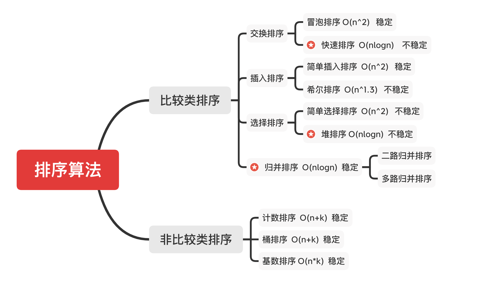

## 作业
**位运算**
- [#191. Number of 1 Bits](./Leetcode-191-380.js)
- [#231. Power of Two](./Leetcode-231-380.js)
- [#190. Reverse Bits](./Leetcode-190-380.js)
- [#51. N-Queens](./Leetcode-51-380.js)
- [#52. N-QueensII](./Leetcode-52-380.js)

**排序**
- [#1122. Relative Sort Array](./Leetcode-1122-380.js)
- [#242. Valid Anagram](./Leetcode-242-380.js)
- [#1244. Design A Leaderboard](./Leetcode-1244-380.js)
- [#56. Merge Intervals](./Leetcode-56-380.js)

## 学习笔记

**位运算**
- 为什么需要位运算
  - 直接进行二进制运算，速度快，比十进制运算要快很多
- 位运算常用场景
  - 判断奇偶
      - x % 2 == 1  ——>  (x & 1) == 1  (判断二进制最后一位是0或1)
      - x % 2 == 0 ——>  (x & 1) == 0
  - 除2运算
      - x = x / 2 ——>  x = x >> 1 (右移一位)
  - 清零最低位的1
      - x = x & (x-1)
  - 得到最低位的1
      - x & -x
  - x & ~x =⇒ 0

**布隆过滤器（Bloom Filter）**
- 是什么
    - 一个很长的二进制向量和一系列随机映射函数
- 干嘛用
    - 用于检索一个元素是否在一个集合中
- 为什么用它
    - Bloom Filter vs Hash Table
        - 哈希表是精确存储信息，如果产生哈希冲突会采用拉链式存储，保证所有数据都存储精确
        - 布隆过滤器的空间效率和查询效率都远远超过一般的算法
        - 布隆过滤器是一种模糊的查询方式，缺点是有一定的误识别率和删除困难

**LRU Cache**
- 常规实现：Hash Table + Double LinkedList
- 效率： 查询、修改都是 O(1)

**比较类排序**
- 通过比较来决定元素间的相对次序，其时间复杂度不能突破 O(nlogn)，属于非线性时间排序
- 适用于各种数据结构，数字类型，字符串类型，对象类型等

**非比较类排序**
- 不通过比较来决定元素间的相对次序，它可以突破基于比较排序的时间下界，以线性时间运行，属于线性时间排序
- 一般只适用于整数型数据，同时需要额外的内存空间



### 初级排序 O(n^2)

- 选择排序
    - 每次找最小值，然后放到待排序数组的起始位置
      ```javascript
      // 选择排序
      export default (nums) => {
        for (let i = 0; i < nums.length; i++) {
          let min = nums[i]
          for (let j = i+1; j < nums.length; j++) {
            if (nums[j] < min) [nums[j], min] = [min, nums[j]]
          }	
          arr[i] = min
        }
      }
      ````

- 插入排序
    - 从前到后逐步构建有序序列；对于未排序数据，在已排序序列中从后向前扫描，找到相应位置并插入
      ```javascript
      // 插入排序
      export default (nums) => {
        for (let i = 1; i < nums.length; i++) {
          for (let j = i; j > 0; j--) {
            if (nums[j-1] <= nums[i]) break
            nums[j] = nums[j-1]
          }
          nums[j] = nums[i]
        }
      }
      ```

- 冒泡排序
    - 嵌套循环，每次查看相邻的元素如果逆序，就交换
      ```javascript
      // 冒泡排序
      export default (nums) => {
        for (let i = nums.length-1; i > 0; i--) {
          for (let j = 0; j < i; j++) {
            if (nums[j] > nums[j+1]) [nums[j], nums[j+1]] = [nums[j+1], nums[j]]
          }		
        }
      }
      ```

### 高级排序 O(nlogn)

- 快速排序
    - 数组取标杆 pivot，将小元素放在 pivot 左边，大元素放右侧，然后依次对右边和右边的子数组继续快排；以达到整个序列有序
      ```javascript
      // 快速排序
      const quickSort = (nums, left, right) => {
        if (nums.length <= 1) return nums
        if (left < right) {
          index = partition(nums, left, right)
          quickSort(nums, left, index-1)
          quickSort(nums, index+1, right)
        }
      }
      
      const partition = (nums, left, right) => {
        let pivot = left, index = left + 1
        for (let i = index; i <= right; i++) {
          if (nums[i] < nums[pivot]) {
            [nums[i], nums[index]] = [nums[index], nums[i]]
            index++
          }
        }
        [nums[pivot], nums[index-1]] = [nums[index-1], nums[pivot]]
        return index
      }
      
      quickSort(nums, 0, nums.length-1)
      return nums
      ```
        

- 归并排序
    - 把长度为 n 的序列分成两个长度为 n/2 的子序列
    - 对子序列分别采用归并排序
    - 将两个排序好的子序列合并成一个最终的排序序列
      ```javascript
      // 归并排序
      const mergeSort = (nums) => {
        if (nums.length <= 1) return nums
        let mid = Math.floor(nums.length/2), 
            left = nums.slice(0, mid), 
            right = nums.slice(mid)
        return merge(mergeSort(left), mergeSort(right))
      }
      
      const merge(left, right) => {
        let result = []
        while(left.length && right.length) {
          result.push(left[0] <= right[0] ? left.shift() : right.shift()
        }
        while(left.length) result.push(left.shift())
        while(right.length) result.push(right.shift())
        return result
      }
      ```
    - 归并和快排具有相似性，但步骤顺序相反
        - 归并：先一分为二，分成左右子数组，分别排序左右子数组，再合并
        - 快排：先选择pivot，然后分成左右，左边为已排序，再对右子数组继续快排，以达到整个序列有序

- 堆排序
    - 分大顶堆和小顶堆
    - 插入、删除堆操作 O(logn)，取最大值最小值都是 O(1)
    - 数组元素依次建立小顶堆
    - 依次取堆顶元素，并删除
- 计数排序
    - 计数排序的核心在于将输入的数据值转化为键存储在额外开辟的数组空间中。作为一种线性时间复杂度的排序，计数排序要求输入的数据必须是有确定范围的整数。
- 桶排序
    - 桶排序是计数排序的升级版。它利用了函数的映射关系，高效与否的关键就在于这个映射函数的确定。为了使桶排序更加高效，我们需要做到这两点：
        1. 在额外空间充足的情况下，尽量增大桶的数量
        2. 使用的映射函数能够将输入的 N 个数据均匀的分配到 K 个桶中
    - 同时，对于桶中元素的排序，选择何种比较排序算法对于性能的影响至关重要。
- 基数排序
    - 先排各位的值，0-9；再排十位的值，0-9；依此类推
    - 基数排序是一种非比较型整数排序算法，其原理是将整数按位数切割成不同的数字，然后按每个位数分别比较。由于整数也可以表达字符串（比如名字或日期）和特定格式的浮点数，所以基数排序也不是只能使用于整数。

**扩展阅读**

- 十大经典排序算法多语言实现  [https://sort.hust.cc/](https://sort.hust.cc/)